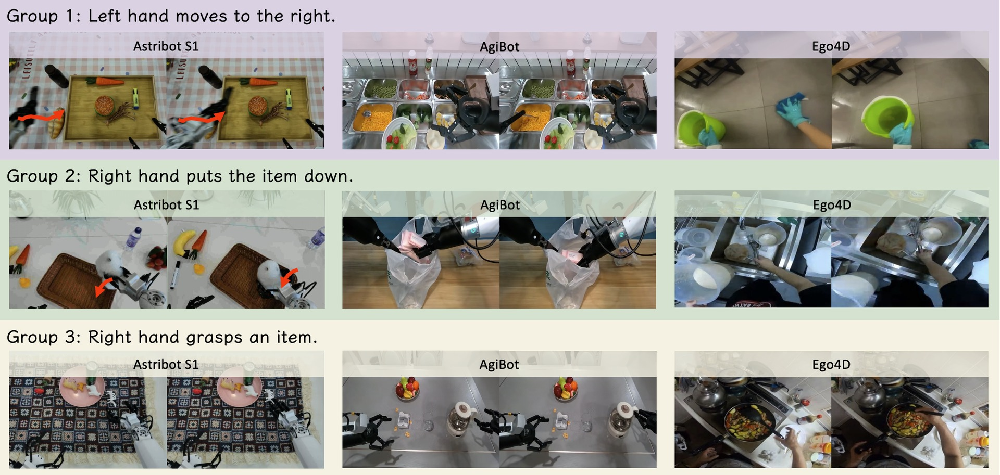
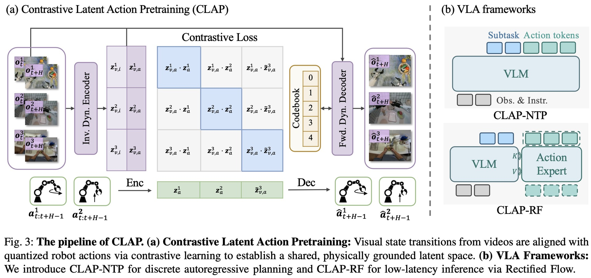

<div align="center">

# 👏🏻 OpenCLAP

### CLAP: Contrastive Latent Action Pretraining for Learning Vision-Language-Action Models from Human Videos

*Bridging human videos and robot control through a physically grounded latent action space.*

[](https://opensource.org/licenses/MIT)
[](https://arxiv.org/abs/2601.04061)
[](https://lin-shan.com/CLAP/)
[](https://huggingface.co/collections/LinShan/clap)



</div>

---

## TL;DR

OpenCLAP is the open-source release of **CLAP** (Contrastive Latent Action Pretraining), a three-stage recipe for training generalist VLAs from a mixture of robot teleoperation data and unlabeled human videos. CLAP first learns an executable action vocabulary (**Act-VAE**), then aligns human and robot visual transitions to it through contrastive learning (**VD-VAE**), and finally trains an autoregressive policy on robot tokens and human pseudo-tokens (**CLAP-NTP**). For deployment we attach a rectified-flow continuous head (**CLAP-RF**) regularized against the frozen NTP reference via **Knowledge Matching (KM)**.

OpenCLAP ships:
- The Lightning-based **Stage 1 / Stage 2** trainer for Act-VAE and VD-VAE under `clap/`.
- The **Stage 3 (CLAP-NTP)** and **post-training (CLAP-RF + KM)** recipes built on [starVLA](https://github.com/starVLA/starVLA) framework.
- End-to-end training and evaluation scripts for **Astribot S1** (real robot) and **LIBERO** (simulation).

📄 [Paper](https://arxiv.org/abs/2601.04061) &nbsp;·&nbsp; 🌐 [Project page](https://lin-shan.com/CLAP/) &nbsp;·&nbsp; 🤗 [Pretrained models](https://huggingface.co/collections/LinShan/clap)

---

## Highlights

- **Executable latent actions.** Act-VAE quantizes 14-DoF dual-arm trajectories into a compact codebook. Decoded tokens reproject to the image plane as physically valid trajectories (Fig. 1 in the paper).
- **Disentangled video alignment.** VD-VAE separates motion-relevant from action-irrelevant latents via factorized attention over DINOv3 features and a SigLIP-style contrastive loss against frozen Act-VAE codes.
- **One backbone, two heads.** CLAP-NTP (autoregressive subtask + action tokens on Qwen3-VL-4B) for instruction following and reasoning; CLAP-RF (DiT rectified-flow head over the NTP KV cache) for low-latency continuous control.
- **Knowledge Matching post-training.** Reverse-KL regularization toward a frozen NTP reference keeps the trainable token policy in a trusted region, matching the precision of full fine-tuning without the catastrophic forgetting.
- **Strong empirical results.** 62.7% mean success on five real-world Astribot S1 tasks (vs. 60.0% for π₀.₅), 70.0% mean under environmental perturbations (vs. 56.7%), and 97.2% on LIBERO as a single generalist policy.
- **Human-video transfer that actually works.** Adding egocentric human demos lifts Make Bouquets (OOD) from 10% to 45% and PnP (OOD) from 70% to 85% — without any extra robot teleoperation.

---

## Method overview

<div align="center">

</div>

```
                            ┌─────────────────────────────────────┐
   Robot trajectories  ───▶ │  Stage 1 — Act-VAE (VQ-VAE)         │ ───▶  C_act (codebook)
   a_{t:t+H}                │   exec-grounded action tokens       │
                            └─────────────────────────────────────┘
                                            │ frozen E_act, C_act
                                            ▼
   Robot + human       ┌──────────────────────────────────────────┐
   visual transitions  │  Stage 2 — VD-VAE                        │
   (o_t, o_{t+H})  ──▶ │   inverse dynamics on DINOv3 features    │ ───▶  pseudo-action tokens ẑ_a
                       │   contrastive align z_v,a ↔ E_act(a_gt)  │       (for human videos)
                       └──────────────────────────────────────────┘
                                            │
                                            ▼
   Images + lang       ┌──────────────────────────────────────────┐
   + tokens (z_a, ẑ_a) │  Stage 3 — CLAP-NTP                      │ ───▶  ϕ_pre  (Qwen3-VL-4B AR policy)
                       │   next-token: subtask + action tokens    │
                       └──────────────────────────────────────────┘
                                            │
                                            ▼
   Target-domain       ┌──────────────────────────────────────────┐
   robot data          │  Post-training — CLAP-RF + KM            │ ───▶  ϕ_policy + RF action head
                       │   rectified-flow head on NTP KV cache    │       (continuous action chunks)
                       │   reverse-KL to frozen NTP reference     │
                       └──────────────────────────────────────────┘
```

---

## Installation

```bash
# 1. Environment
conda create -n openclap python=3.10 -y && conda activate openclap

# 2. Core dependencies
pip install -r requirements.txt

# 3. Flash-Attention (must match your local nvcc + torch)
pip install flash-attn --no-build-isolation

# 4. Editable install of the OpenCLAP package
pip install -e .
```

For LIBERO simulation evaluation, follow the upstream LIBERO install in a separate `libero` conda env (the policy server stays in `openclap`, the sim client uses `libero`).

---

## Pretrained checkpoints

| Stage | Description | URL |
|---|---|---|
| Stage 3 (CLAP-NTP) | Qwen3-VL-4B AR policy pretrained on AgiBot + Astribot + DROID + Ego4D | [`LinShan/clap-qwen3vl4b`](https://huggingface.co/LinShan/clap-qwen3vl4b) |
| LIBERO post-trained (CLAP-RF + KM) | Single generalist policy across LIBERO Spatial / Object / Goal / Long | [`LinShan/clap-qwen3vl4b-libero`](https://huggingface.co/LinShan/clap-qwen3vl4b-libero) |

Download with the HuggingFace CLI:

```bash
# Stage 3 pretrained — full Qwen3-VL-4B AR policy + the frozen Stage-2 CLAP tokenizer
hf download LinShan/clap-qwen3vl4b --local-dir ./pretrained/clap-s3-l32

# LIBERO post-trained (CLAP-RF + KM)
hf download LinShan/clap-qwen3vl4b-libero \
  --local-dir ./ckpts/Checkpoints/libero_clap_s3_l32_qwen3vl4b_km_l16
```

The Stage-3 directory contains the AR policy weights and the bundled `clap.ckpt` (frozen Stage-2 tokenizer) referenced by the QwenPIKM/QwenAR YAMLs as `framework.knowledge_matching.clap.clap_ckpt`.

---

## Quick start

All commands below assume you have activated the `openclap` env and run them from the repo root.

> **Smoke testing the pipeline.** Every launcher script supports `SMOKE_TEST=1`, which drops the step budget to 2–5, single-GPU, batch size 1–2 — useful for confirming the data path + model graph are wired correctly without committing to a full run. We bundle a minimal 2-episode Astribot dataset under [`assets/dummy_dataset/`](assets/dummy_dataset/README.md) (~35 MB) so the full Quick Start can be smoke-tested without external data. Run `python scripts/smoke_test.py` for synthetic-data checks and `python scripts/smoke_test_e2e.py` for the real-data end-to-end check.

### Stage 1 — Train Act-VAE

The `clap/` package is a self-contained PyTorch-Lightning project. Stage 1 learns the discrete action codebook from robot trajectories.

```bash
bash clap/scripts/run_stage1.sh

# Smoke test
# Uses the bundled 2-episode dummy dataset under assets/dummy_dataset/.
SMOKE_DATASET=$PWD/assets/dummy_dataset \
  SMOKE_TEST=1 bash clap/scripts/run_stage1.sh
```

Open-loop reconstruction test on a held-out split:

```bash
bash clap/scripts/test_stage.sh clap/configs/clap-s1-l32.yaml \
                                clap/ckpts/clap-s1-l32/last.ckpt
```

### Stage 2 — Train VD-VAE

Stage 2 reuses the frozen Act-VAE encoder/codebook from Stage 1 and aligns video transitions to it. Set the Stage-1 checkpoint path inside `clap/configs/clap-s2-l32.yaml` (default: `./clap/ckpts/clap-s1-l32/last.ckpt`).

```bash
bash clap/scripts/run_stage2.sh

# Smoke
SMOKE_TEST=1 bash clap/scripts/run_stage2.sh \
  --model.stage_one_ckpt=./clap/ckpts/clap-s1-l32/last.ckpt
```

After training, VD-VAE will tokenize human videos into pseudo action tokens consumed by Stage 3.

### Stage 3 — CLAP-NTP pretraining (Astribot S1)

Stage 3 trains the Qwen3-VL-4B autoregressive policy on robot tokens + human pseudo-tokens. Use the provided launcher (it wraps `accelerate launch` with the right DeepSpeed config and YAML overrides):

```bash
# Full run
bash examples/Astribot/train_files/run_astribot_qwenar.sh

# Smoke (3 steps, 1 GPU)
SMOKE_TEST=1 PET_NPROC_PER_NODE=1 \
  bash examples/Astribot/train_files/run_astribot_qwenar.sh
```

Or invoke the trainer directly:

```bash
accelerate launch \
  --config_file starVLA/config/deepseeds/deepspeed_zero2.yaml \
  --num_processes 8 \
  starVLA/training/train_starvla.py \
  --config_yaml examples/Astribot/train_files/starvla_astribot_qwenar.yaml \
  --framework.name QwenAR \
  --run_root_dir ./results/Checkpoints --run_id clap_ntp_astribot
```

> Smoke at single-GPU bs=1 will go through model load → dataloader build → first forward+backward step, then **OOM at the Adam state allocation**. That's expected — the full recipe needs ZeRO-2/3 across 8 GPUs to fit. The OOM is sufficient evidence that the training graph is wired correctly end-to-end.

### Post-training — CLAP-RF + KM (Astribot S1)

The post-training launcher supports two modes via an env flag: `km` for Knowledge Matching (reverse-KL to the frozen NTP reference) and `ki` for Knowledge Insulation (the more restrictive baseline reported in Table VI).

```bash
# Knowledge Matching (default, recommended)
MODE=km bash examples/Astribot/train_files/run_astribot_qwenpikm.sh

# Knowledge Insulation (ablation)
MODE=ki bash examples/Astribot/train_files/run_astribot_qwenpikm.sh
```

The framework name is `QwenPIKM` and the action head is a flow-matching DiT that attends to the NTP backbone's KV cache.

### LIBERO finetune

A single generalist policy across all four LIBERO suites (Spatial / Object / Goal / Long), trained for 30k steps at batch size 128 with KM:

```bash
bash examples/LIBERO/train_files/run_libero_clap_km_l16.sh

# Smoke (5 steps, 1 GPU, bs=1)
SMOKE_TEST=1 PET_NPROC_PER_NODE=1 per_device_batch_size=1 \
  bash examples/LIBERO/train_files/run_libero_clap_km_l16.sh
```

The corresponding YAML is `examples/LIBERO/train_files/starvla_libero_clap_km_l16.yaml`.

### LIBERO evaluation (client–server split)

Run the policy server in the `openclap` env, then launch the simulator client in your `libero` env on the same host.

```bash
# Terminal 1 (openclap env): start the policy server, wait for "server listening on 0.0.0.0:6694"
bash examples/LIBERO/eval_files/run_policy_server.sh

# Terminal 2 (libero env): run the simulation client
bash examples/LIBERO/eval_files/eval_libero.sh
```

The LIBERO server uses the generic `deployment/model_server` infrastructure.

A single generalist policy ([`LinShan/clap-qwen3vl4b-libero`](https://huggingface.co/LinShan/clap-qwen3vl4b-libero)) across all four suites, post-trained with CLAP-RF + KM:

| Spatial | Object | Goal | Long | Average |
|:---:|:---:|:---:|:---:|:---:|
| 98.6 | 99.2 | 98.0 | 93.0 | **97.2** |

### Astribot S1 evaluation (sync inference)

For real-robot deployment, OpenCLAP ships a synchronous policy server tailored to the Astribot S1 control loop:

```bash
# Terminal 1: launch the sync policy server
bash examples/Astribot/eval_files/run_sync_policy_server.sh

# Terminal 2: connect the robot client
python examples/Astribot/eval_files/sync_policy_client.py --host <server-ip> --port <port>
```

---

## Repository layout

```
OpenCLAP/
├── clap/                          Stage 1 (Act-VAE) + Stage 2 (VD-VAE), Lightning-based
│   ├── modules/                     core nn modules (ContrastiveDINOLatentActionModel,
│   │                                MldVae, blocks, ...)
│   ├── configs/                     clap-s1-l32.yaml, clap-s2-l32.yaml
│   ├── model_clap.py                DINO_CLAP LightningModule (trainer + open-loop test)
│   ├── dataset_lerobot.py           LightningLerobot
│   ├── data_transform*.py           LeRobot / DROID / single-arm transforms
│   ├── unified_action.py            14-DoF dual-arm action canonicalization
│   ├── robot_prompt.py              instruction templating
│   ├── custom_lerobot.py            dataset wrapper
│   ├── action_expert.py             Act-VAE / VD-VAE expert wiring
│   └── main_clap.py                 Lightning CLI entry point
├── starVLA/                       VLA framework (compatible subset of upstream starVLA)
│   ├── model/framework/VLM4A/       QwenAR.py (CLAP-NTP), QwenPIKM.py (CLAP-RF + KM), ...
│   ├── model/modules/               vlm/, action_model/, dino_model/, projector/, world_model/
│   ├── dataloader/                  model-agnostic LeRobot / VLM loaders
│   ├── training/                    train_starvla.py and friends
│   └── config/                      DeepSpeed + base training YAMLs
├── examples/
│   ├── Astribot/
│   │   ├── train_files/             clap-s3 AR pretrain + qwenpikm post-train (km / ki)
│   │   └── eval_files/              sync policy server + client
│   └── LIBERO/
│       ├── train_files/             libero_clap_km_l16 finetune
│       └── eval_files/              policy server + sim client launchers
├── deployment/                    Generic policy server (used by LIBERO eval)
├── requirements.txt, pyproject.toml, environment.yml
└── LICENSE                        MIT
```

---

## Citation

If you find OpenCLAP useful, please cite the paper:

```bibtex
@article{zhang2026clap,
  title={CLAP: Contrastive Latent Action Pretraining for Learning Vision-Language-Action Models from Human Videos},
  author={Zhang, Chubin and Wang, Jianan and Gao, Zifeng and Su, Yue and Dai, Tianru and Zhou, Cai and Lu, Jiwen and Tang, Yansong},
  journal={arXiv preprint arXiv:2601.04061},
  year={2026}
}
```

---

## Acknowledgements

OpenCLAP builds on a number of open-source projects we are grateful for:

- [UniVLA](https://github.com/OpenDriveLab/UniVLA) and [LAPA](https://github.com/LatentActionPretraining/LAPA) for prior work on latent action models.
- [starVLA](https://github.com/starVLA/starVLA) for the VLA framework.
